# TinyGPT: Specialized College Admissions Assistant & Neural LM

**TinyGPT** is a decoder-only GPT-style Transformer language model built completely from scratch in pure PyTorch. Originally designed as a toy model for understanding Transformer internals, it has been scaled and specialized into a domain-specific **University Undergraduate Admissions Assistant Bot**.

The project demonstrates how causal self-attention, token embeddings, positional encodings, and autoregressive generation can be adapted from a toy setup into an accurate, factual domain assistant running entirely on CPU.

---

## 🗺️ System Architecture & Workflow Diagram

The diagram below illustrates both the **Training Pipeline** (offline learning) and the **Inference Pipeline** (interactive bot runtime):

```mermaid
flowchart TD
    subgraph TrainFlow["1. Offline Training Pipeline"]
        A["Admissions Corpus (data/admissions_data.txt)"] --> B["Domain Tokenizer (Currency, Decimals, Special Tokens)"]
        B --> C["LanguageModelDataset (Context Window: 128)"]
        C --> D["PyTorch DataLoader (Batch Size: 16)"]
        D --> E["TinyGPT Model (4 Layers, 128 Dim, 4 Heads)"]
        E --> F["AdamW + Cosine Scheduler (Loss Target < 0.15)"]
        F --> G["Trained Checkpoint (checkpoints/tinygpt_admissions.pt)"]
    end

    subgraph ChatFlow["2. Interactive Bot Runtime"]
        H["Applicant Question in Terminal"] --> I{"Command Router"}
        I -->|faq| J["Display FAQ Quick Answers"]
        I -->|deadlines| K["Display Application Deadlines"]
        I -->|contact| L["Display Admissions Office Info"]
        I -->|debug| M["Display Internal Attention Weights & Logits"]
        I -->|Standard Question| N["Format Prompt: BOS USER query ASSISTANT"]

        N --> O["Tokenize & Encode to Token IDs"]
        O --> P["Context Slice (Last 128 Tokens)"]
        P --> Q["Forward Pass (4x Transformer Blocks)"]
        Q --> R["LM Head Projection to Logits"]
        R --> S["Apply Repetition Penalty (1.15)"]
        S --> T["Factual Sampling (Top-K: 5, Temp: 0.30)"]
        T --> U{"End Token (EOS) or Max Length?"}
        U -->|No| P
        U -->|Yes| V["Detokenize & Output Response to Applicant"]
    end
```



---

## 🌟 What We Did Better: Admissions Bot vs. Original Toy Model

Guided by our implementation roadmap in [changesForBot.md](file:///c:/projects/NLP/changesForBot.md), the system underwent architectural scaling, data curation, tokenization upgrades, and factual generation calibration:

| Dimension | Original Toy TinyGPT | Enhanced Admissions TinyGPT | Why It Matters |
| :--- | :--- | :--- | :--- |
| **Domain Knowledge Base** | ~40 generic CS/programming pairs (`conversations.txt`) | **180+ curated admission Q&A pairs** (`admissions_data.txt`) spanning 7 critical categories | Eliminates out-of-domain babble; equips model with actual university policies. |
| **Tokenizer Capabilities** | Basic word-level regex; stripped symbols & fragmented numbers | **Domain-aware Regex Tokenizer**: Atomic currency (`$18,500`), GPA/decimals (`3.0`, `4.0`), emails (`admissions@university.edu`), phone numbers, & contractions | Preserves exact numbers, fees, and contact info as single tokens without vocab noise. |
| **Context Length** | 64 tokens | **128 tokens** | Accommodates multi-sentence answers, complex eligibility criteria, and fee breakdowns. |
| **Model Architecture** | 2 layers, 64 dim, 4 heads, 256 FFN (~188K params) | **4 layers, 128 dim, 4 heads, 512 FFN (~808K params)** | 4.3× increase in parameter capacity for deep semantic retention while training in <90s on CPU. |
| **Sampling & Inference** | High randomness (`temp=0.8`, `top_k=20`) | **Factual sampling** (`temp=0.25–0.30`, `top_k=5`, repetition penalty `1.15`) | Minimizes hallucination; forces deterministic output for dates, deadlines, and dollar figures. |
| **User Experience (CLI)** | Plain terminal chat | **Admissions Terminal Assistant** with welcome banner, built-in shortcuts (`faq`, `deadlines`, `contact`), and neural attention debugger | Real-time domain shortcuts + transparent model explainability. |
| **Verification & Testing** | None (manual spot checks only) | **Automated Factual Verification Benchmark** (`evaluate_admissions.py`) | Quantifiable verification across 12 domain categories with automated keyword scoring. |

---

## 📊 Benchmark & Factual Verification Results

The automated benchmark suite (`evaluate_admissions.py`) evaluates the model against 12 core admission questions, checking for exact factual keywords in the generated responses:

```
======================================================================
COLLEGE ADMISSIONS BOT - BENCHMARK & FACTUAL VERIFICATION
======================================================================

[1/12]  [Requirements]     [PASS]  Min GPA: 3.0 / 4.0 scale
[2/12]  [Testing Policy]   [PASS]  Test-optional policy for SAT / ACT
[3/12]  [Deadlines]        [PASS]  Regular Decision: January 15th
[4/12]  [Deadlines]        [PASS]  Early Action: November 1st
[5/12]  [Tuition & Costs]  [PASS]  Tuition: $18,500 in-state / $32,000 out-of-state
[6/12]  [Tuition & Costs]  [PASS]  Application fee: $65 domestic / $85 international
[7/12]  [Financial Aid]    [PASS]  Automatic merit scholarships: $3,000 to $15,000
[8/12]  [Financial Aid]    [PASS]  Federal FAFSA code: 001234
[9/12]  [Campus Life]      [PASS]  First-year guaranteed housing (deadline: June 1st)
[10/12] [Programs]         [PASS]  Computer Science tracks (AI, software engineering)
[11/12] [Contact]          [PASS]  Official email & toll-free phone (1-800-555-0199)
[12/12] [International]    [PASS]  TOEFL (80), IELTS (6.5), Duolingo (110)

======================================================================
BENCHMARK RESULT: 12/12 tests passed (100.0%)
======================================================================
```

---

## ⚙️ Step-by-Step Setup Guide

Follow these steps to set up the environment and run the Admissions Bot from scratch:

### Step 1: Open the Project Directory
Navigate to the root directory in your terminal:
```bash
cd c:\projects\NLP\tiny-gpt
```

### Step 2: Create a Virtual Environment
Isolate Python dependencies using `venv`:

- **Windows:**
  ```powershell
  python -m venv .venv
  ```
- **macOS / Linux:**
  ```bash
  python3 -m venv .venv
  ```

### Step 3: Activate the Virtual Environment
- **Windows (PowerShell):**
  ```powershell
  .venv\Scripts\Activate.ps1
  ```
- **Windows (Command Prompt):**
  ```cmd
  .venv\Scripts\activate.bat
  ```
- **macOS / Linux:**
  ```bash
  source .venv/bin/activate
  ```

### Step 4: Install Dependencies
Install the required packages (`torch` and `numpy`):
```bash
pip install -r requirements.txt
```
*(No GPU or CUDA drivers are needed — the entire model runs fast on CPU).*

### Step 5: Verify or Train Model Weights
If `checkpoints/tinygpt_admissions.pt` is already present, you can proceed directly to testing. To train or retrain from the raw corpus:
```bash
python train_admissions.py
```
*Training takes ~60–90 seconds on standard CPUs and reaches an early-stopping loss $< 0.15$.*

### Step 6: Run the Benchmark Test Suite
Validate the model's factual accuracy:
```bash
python evaluate_admissions.py
```

### Step 7: Launch the Interactive Admissions Bot
Start the terminal interface:
```bash
python admissions_chat.py
```

---

## 🔄 Step-by-Step Internal Working of the Bot

When an applicant interacts with the bot, here is the exact sequence of internal operations:

```
[User Input] ➡️ [Router/Interceptor] ➡️ [Prompt Template] ➡️ [Tokenizer] ➡️ [Embedding + Positional] 
     ➡️ [4x Transformer Layers (Pre-LN + Causal Attention + FFN)] ➡️ [LM Head] 
     ➡️ [Repetition Penalty] ➡️ [Top-K + Low-Temp Sampling] ➡️ [Detokenizer] ➡️ [Terminal Output]
```

### 1. Input Interception & Route Dispatching
- In [admissions_chat.py](file:///c:/projects/NLP/tiny-gpt/admissions_chat.py), user text is normalized.
- If the user types a command shortcut (`faq`, `deadlines`, `contact`), the terminal responds immediately with pre-compiled factual tables without consuming compute.
- If prefixed with `debug <text>`, the system enters explainability mode, breaking down tensor representations and self-attention weights across all 4 layers.

### 2. Prompt Structuring
- To maintain conversational alignment learned during training, the prompt is framed with special delimiters:
  ```
  <BOS> <USER> when is the application deadline? <ASSISTANT>
  ```

### 3. Domain-Aware Tokenization
- The enhanced regex in [src/tokenizer.py](file:///c:/projects/NLP/tiny-gpt/src/tokenizer.py) processes the string:
  - Currency amounts like `$18,500` or `$65` are preserved as atomic single tokens.
  - Numbers with decimals like `3.0` and `4.0` are kept intact rather than split into period tokens.
  - Contact emails like `admissions@university.edu` and phone numbers remain cohesive tokens.
- Words are looked up in `token_to_id` (vocabulary of ~808 tokens). Any unseen words fall back cleanly to `<UNK>`.

### 4. Positional & Token Embeddings
- The sequence of token IDs is passed into [src/embeddings.py](file:///c:/projects/NLP/tiny-gpt/src/embeddings.py) and [src/positional_embedding.py](file:///c:/projects/NLP/tiny-gpt/src/positional_embedding.py).
- Each token is transformed into a 128-dimensional embedding vector, and position embeddings ($0$ to $127$) are added to inject word order information.

### 5. Multi-Layer Transformer Processing (4 Blocks)
The tensor `[seq_len, 128]` propagates through 4 stacked Transformer blocks:
- **Pre-Layer Normalization**: Applied before attention for stable gradients.
- **Causal Multi-Head Self-Attention**:
  - 4 parallel attention heads ($128 / 4 = 32$ dimensions each).
  - Upper-triangular causal mask (`-inf`) prevents positions from looking at future tokens.
- **Residual Connection**: Input is added back: $x = x + \text{Attention}(\text{LN}(x))$.
- **Feed-Forward Network (FFN)**:
  - Two-layer projection expanding from 128 to 512 dimensions with GELU non-linearity, then projected back to 128 dimensions.
- **Residual Connection**: $x = x + \text{FFN}(\text{LN}(x))$.

### 6. LM Head & Logit Generation
- Output from the 4th block passes through a final LayerNorm and a linear projection head `[128 -> vocab_size]`, yielding raw unbounded scores (logits) for every token in the vocabulary.

### 7. Repetition Penalty
- In [src/generation.py](file:///c:/projects/NLP/tiny-gpt/src/generation.py), tokens already generated in the current response have their logits discounted by a factor of $1.15$ to prevent repetitive phrasing or stuck loops.

### 8. Factual Sampling (Top-K + Low Temperature)
- **Top-K Truncation**: Only the top $K=5$ most probable tokens are kept; all other logits are set to $-\infty$.
- **Temperature Scaling ($T = 0.30$)**: Logits are divided by $0.30$ before applying Softmax. This sharpens the probability distribution around the highest-confidence token, preventing factual deviation.

### 9. Autoregressive Rollout
- The selected token is appended to the sequence. The loop repeats until:
  - The model outputs the `<EOS>` (end of sentence) token, or
  - The `max_new_tokens` limit (65 tokens) is reached.

### 10. Detokenization & Presentation
- Token IDs are mapped back to strings via `id_to_token`, cleaned of special tokens, and formatted cleanly onto the terminal for the applicant.

---

## 💻 Interactive Usage Guide & Sample Commands

```bash
python admissions_chat.py
```

### Sample Questions to Try:
- `what is the minimum gpa for admission?`
- `when is the regular decision deadline?`
- `how much is tuition for in-state students?`
- `is the sat or act required?`
- `what scholarships are available?`
- `is freshman housing guaranteed?`
- `what computer science tracks do you offer?`
- `how do i contact the admissions office?`

### Built-in CLI Shortcuts:
- `faq` &mdash; View top frequently asked questions.
- `deadlines` &mdash; View all application rounds and priority dates.
- `contact` &mdash; View official office email, toll-free number, and physical office hours.
- `debug <query>` &mdash; Inspect token IDs, tensor shapes, and attention heads.
- `quit` &mdash; Exit the application.

---

## 📁 Project Directory Structure

```
tiny-gpt/
├── data/
│   ├── admissions_data.txt       # Curated university admissions Q&A corpus (180+ pairs)
│   └── conversations.txt         # Original legacy CS/programming dialogues
├── checkpoints/
│   ├── tinygpt_admissions.pt     # Trained Admissions Model (4 layers, 128 dim, 128 ctx)
│   └── tinygpt_v2.pt             # Legacy toy model checkpoint
├── src/
│   ├── model.py                  # TinyGPT architecture (Transformer blocks, LayerNorm, LM head)
│   ├── tokenizer.py              # Regex tokenizer with currency, GPA, email & phone handling
│   ├── dataset.py                # Sequence chunker & LanguageModelDataset loader
│   ├── generation.py             # Autoregressive generation with temperature, top-k & repetition penalty
│   ├── attention.py              # Multi-head causal self-attention with causal masking
│   ├── transformer_block.py      # Pre-LN Transformer block with residual connections
│   ├── feed_forward.py           # Two-layer MLP with GELU activation
│   ├── embeddings.py             # Token embedding lookup
│   ├── positional_embedding.py   # Learned positional embeddings
│   └── checkpoint.py             # Checkpoint serialization and deserialization
├── train_admissions.py           # Training pipeline optimized for admissions model
├── admissions_chat.py            # Admissions assistant terminal UI with shortcuts & debug
├── evaluate_admissions.py        # 12-category automated factual benchmark suite
├── main.py                       # Original train-and-chat runner for legacy model
├── chat_v2.py                    # Standalone chat for legacy model
├── requirements.txt              # PyTorch and NumPy dependencies
└── changesForBot.md              # Detailed implementation plan & design roadmap
```

---

## 🧠 Model Specifications & Hyperparameters

| Hyperparameter | Original Toy Model | Admissions Model | Rationale |
| :--- | :--- | :--- | :--- |
| **Context Length** | 64 tokens | **128 tokens** | Accommodates complete answers and lists without cutoff. |
| **Embedding Dimension ($d_{\text{model}}$)** | 64 | **128** | Captures richer semantic vectors for domain terminology. |
| **Attention Heads** | 4 (dim 16) | **4 (dim 32)** | Enhanced attention projection per head. |
| **Transformer Layers** | 2 | **4** | Deeper representation for multi-step policy logic. |
| **Feed-Forward Dimension** | 256 | **512** | Standard $4 \times d_{\text{model}}$ expansion ratio. |
| **Vocabulary Size** | ~653 tokens | **~808 tokens** | Includes specialized numeric and currency tokens. |
| **Total Parameters** | ~188,000 | **~808,000** | Scaled capacity while retaining fast CPU computation. |
| **Inference Temperature** | 0.8 | **0.25 – 0.30** | Prevents creative hallucination on factual questions. |
| **Inference Top-K** | 20 | **5** | Restricts candidate pool to top factual choices. |
| **Repetition Penalty** | None | **1.15** | Eliminates circular loops in generation. |
| **Target Training Loss** | 0.30 | **0.15** | Tight factual convergence during training. |

---

## 🛠️ Troubleshooting

- **`ModuleNotFoundError: No module named 'torch'`**
  Ensure your virtual environment is active (`.venv\Scripts\activate` on Windows, `source .venv/bin/activate` on macOS/Linux).
- **`FileNotFoundError: checkpoints/tinygpt_admissions.pt`**
  Run `python train_admissions.py` to train and generate the admissions checkpoint.
- **Windows Terminal Encoding Glitches**
  The scripts automatically reconfigure standard output to UTF-8. If your console displays font artifacts, run:
  ```powershell
  $env:PYTHONIOENCODING="utf-8"
  ```
- **Out of Scope Questions**
  TinyGPT is a specialized ~808K parameter model trained specifically on undergraduate admissions. Questions outside this domain may produce ungrounded tokens. Use the built-in shortcuts (`faq`, `deadlines`, `contact`) or run in factual mode for optimal results.

---

## 📜 License & Credits

Built for educational exploration of Transformer architectures and specialized LLM fine-tuning from scratch. Inspired by the GPT series (Radford et al.) and Andrej Karpathy's `nanoGPT`.
