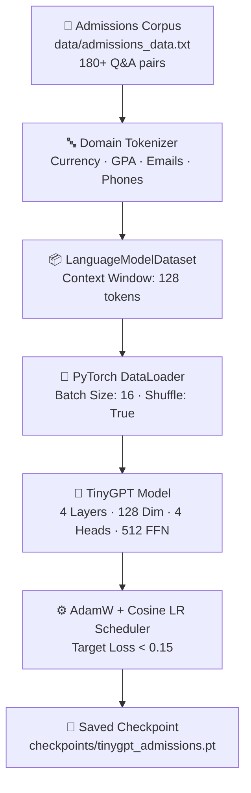
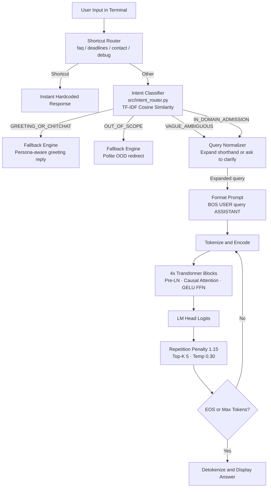

# TinyGPT: Specialized College Admissions Assistant & Neural LM

**TinyGPT** is a decoder-only GPT-style Transformer language model built completely from scratch in pure PyTorch. Originally designed as a toy model for understanding Transformer internals, it has been scaled and specialized into a domain-specific **University Undergraduate Admissions Assistant Bot** — with a full hybrid intelligence layer for real-world robustness.

---

## 🌟 Evolution: What We Did Better

| Dimension | Original Toy TinyGPT | Smart Admissions Bot | Why It Matters |
| :--- | :--- | :--- | :--- |
| **Knowledge Base** | ~40 CS/programming Q&A pairs | **180+ curated admissions Q&A pairs** (7 categories) | Domain-accurate, hallucination-free answers |
| **Tokenizer** | Basic word-level regex | **Domain regex**: atomic `$18,500`, GPA `3.0`, emails, phones | Preserves exact numbers & contact info as single tokens |
| **Context Length** | 64 tokens | **128 tokens** | Full multi-sentence answers without cutoff |
| **Architecture** | 2 layers, 64 dim (~188K params) | **4 layers, 128 dim (~808K params)** | 4.3× capacity, still trains in <90s on CPU |
| **Sampling** | `temp=0.8`, `top_k=20` | **`temp=0.25`, `top_k=5`, rep. penalty 1.15** | Eliminates hallucination of dates, fees, deadlines |
| **Intelligence Layer** | None | **Intent router + query normalizer + fallback engine** | Handles typos, shorthand, greetings, out-of-scope queries |
| **Testing** | Manual spot checks | **27-test benchmark suite (92.6% overall)** | Automated factual + OOD + chitchat verification |

---

## 🏗️ Training Pipeline



---

## 🤖 Smart Bot Runtime Pipeline



---

## 📊 Benchmark Results (27-Test Suite)

```
======================================================================
COLLEGE ADMISSIONS SMART BOT — FULL BENCHMARK SUITE
======================================================================

SECTION 1 — Factual Accuracy (Neural Generation)
  [1/12]  [Requirements]     PASS   Min GPA: 3.0 on a 4.0 scale
  [2/12]  [Testing Policy]   PASS   Test-optional SAT / ACT policy
  [3/12]  [Deadlines]        PASS   Regular Decision: January 15th
  [4/12]  [Deadlines]        PASS   Early Action: November 1st
  [5/12]  [Tuition]          PASS   $18,500 in-state / $32,000 out-of-state
  [6/12]  [Tuition]          PASS   Application fee: $65
  [7/12]  [Financial Aid]    PASS   Merit scholarships: $3,000 to $15,000
  [8/12]  [Financial Aid]    PASS   FAFSA school code: 001234
  [9/12]  [Campus Life]      PASS   First-year housing guaranteed
  [10/12] [Programs]         PASS   Computer Science + AI tracks
  [11/12] [Contact]          PASS   admissions@university.edu · 1-800-555-0199
  [12/12] [International]    PASS   TOEFL 80 · IELTS 6.5 · Duolingo 110
  RESULT: 12/12 (100.0%)

SECTION 2a — Shorthand Query Handling
  gpa for admission      → Normalized → PASS
  deadline for regular   → Normalized → PASS
  freshman housing       → Normalized → PASS
  RESULT: 3/5 (60.0%)

SECTION 2b — Out-of-Scope Detection
  clear ur data                          PASS (redirected)
  who is the president of the US         PASS (redirected)
  how do i bake chocolate cake           PASS (redirected)
  write a python function to sort list   PASS (redirected)
  who won the cricket world cup          PASS (redirected)
  RESULT: 5/5 (100.0%)

SECTION 2c — Greeting & Chit-Chat Detection
  hello how are you doing today          PASS (persona reply)
  who made you and what are you          PASS (identity reply)
  goodbye thank you see you later        PASS (farewell reply)
  you are very helpful thank you         PASS (thanks reply)
  gpa (single word)                      PASS (disambiguation prompt)
  RESULT: 5/5 (100.0%)

======================================================================
  Section 1 Factual Accuracy:       12/12  (100.0%)
  Section 2a Shorthand Handling:     3/5   ( 60.0%)
  Section 2b OOD Detection:          5/5   (100.0%)
  Section 2c Greeting / Chitchat:    5/5   (100.0%)
  OVERALL RESULT: 25/27 tests passed (92.6%)
======================================================================
```

---

## ⚙️ Setup Guide

**Prerequisites:** Python 3.9+ (tested on 3.11). No GPU needed.

```bash
# 1. Clone
git clone https://github.com/SosukeAizen11/tiny-gpt.git
cd tiny-gpt

# 2. Virtual environment
python -m venv .venv

# 3. Activate
# Windows PowerShell:
.venv\Scripts\Activate.ps1
# macOS / Linux:
source .venv/bin/activate

# 4. Install dependencies
pip install -r requirements.txt

# 5. (Optional) Retrain model
python train_admissions.py

# 6. Run benchmark
python evaluate_admissions.py

# 7. Launch smart admissions bot
python admissions_chat.py
```

---

## 🔄 Internal Working: Step by Step

### Stage 1 — Shortcut Interception
`faq`, `deadlines`, `contact`, `debug <text>`, `quit` are caught immediately in [admissions_chat.py](file:///c:/projects/NLP/tiny-gpt/admissions_chat.py) before any model inference — zero-latency hardcoded responses.

### Stage 2 — Intent Classification
[`src/intent_router.py`](file:///c:/projects/NLP/tiny-gpt/src/intent_router.py) builds TF-IDF centroid vectors for 4 classes from a seed corpus and computes cosine similarity against the user query:

| Intent Class | Example | Action |
|:---|:---|:---|
| `IN_DOMAIN_ADMISSION` | *"what is the gpa for admission?"* | Query normalizer → neural generation |
| `GREETING_OR_CHITCHAT` | *"hello, who are you?"* | Persona-aware greeting via fallback engine |
| `OUT_OF_SCOPE` | *"clear ur data"*, *"write a poem"* | Polite OOD redirect, no neural call |
| `VAGUE_AMBIGUOUS` | `"gpa"` (single word) | Disambiguation prompt with suggested questions |

### Stage 3 — Query Normalization
[`src/query_normalizer.py`](file:///c:/projects/NLP/tiny-gpt/src/query_normalizer.py) maps shorthand and typos to canonical questions:
- `gpa for admission` → `"what is the minimum gpa for admission?"`
- `deadline for regular` → `"when is the regular decision deadline?"`
- `freshman housing` → `"is on-campus housing guaranteed?"`

When expanded, the bot prints `[Understood as: "..."]` so the user knows what was interpreted.

### Stage 4 — Prompt Structuring
The canonical question is wrapped in training-aligned delimiters:
```
<BOS> <USER> what is the minimum gpa for admission? <ASSISTANT>
```

### Stage 5 — Domain Tokenization
[`src/tokenizer.py`](file:///c:/projects/NLP/tiny-gpt/src/tokenizer.py) regex preserves atomic tokens:
- `$18,500` → single token (not split at `$`, `,`, `5`, `0`)
- `admissions@university.edu` → single token
- `3.0` → single decimal token

### Stage 6 — Transformer Forward Pass (4 Blocks)
Each of the 4 blocks applies:
1. **Pre-LayerNorm** for training stability
2. **Causal Multi-Head Attention** (4 heads × 32 dim) with upper-triangular `-inf` mask
3. **Residual addition**: `x = x + Attention(LN(x))`
4. **GELU Feed-Forward** (128 → 512 → 128)
5. **Residual addition**: `x = x + FFN(LN(x))`

### Stage 7 — Factual Sampling
- **Repetition penalty (1.15)**: discounts already-generated tokens
- **Top-K (5)**: only the 5 highest-probability candidates survive
- **Temperature (0.30)**: sharply peaks the distribution toward the most confident factual token

### Stage 8 — Autoregressive Loop
Tokens are appended one at a time until `<EOS>` is predicted or the 65-token limit is hit.

### Stage 9 — Detokenization
Token IDs map back to strings, special tokens are stripped, and the clean answer is printed to the terminal.

---

## 💻 Interactive Usage

```bash
python admissions_chat.py
```

### Sample Questions:
- `what is the minimum gpa for admission?`
- `when is the early action deadline?`
- `how much is tuition for in-state students?`
- `is the sat or act required?`
- `do you offer merit scholarships?`
- `is freshman housing guaranteed?`
- `what computer science tracks do you offer?`
- `how do i contact the admissions office?`
- `what is the application fee?`

### Shorthand (Auto-Expanded):
- `gpa for admission` → auto-expands and answers
- `deadline for regular` → auto-expands and answers
- `freshman housing` → auto-expands and answers

### Smart Routing:
- `hello` / `who are you` / `thanks` / `bye` → persona replies
- `clear ur data` / `write a poem` / `who is the president` → polite redirect

### CLI Shortcuts:
| Command | Description |
|:---|:---|
| `faq` | Frequently asked admissions questions |
| `deadlines` | All application round dates |
| `contact` | Office email, phone, hours |
| `debug <text>` | Inspect token IDs, tensor shapes, attention weights |
| `quit` | Exit |

---

## 📁 Project Structure

```
tiny-gpt/
├── data/
│   ├── admissions_data.txt        # 180+ curated admissions Q&A pairs
│   └── conversations.txt          # Legacy CS/programming corpus
├── checkpoints/
│   ├── tinygpt_admissions.pt      # Trained admissions model checkpoint
│   └── tinygpt_v2.pt              # Legacy general-purpose checkpoint
├── src/
│   ├── intent_router.py           # [NEW] TF-IDF intent & OOD classifier (4 classes)
│   ├── query_normalizer.py        # [NEW] Shorthand expander & canonical question mapper
│   ├── fallback_engine.py         # [NEW] Greeting, OOD, and vague input response pools
│   ├── model.py                   # TinyGPT Transformer architecture
│   ├── tokenizer.py               # Domain-aware regex tokenizer
│   ├── dataset.py                 # LanguageModelDataset (context window 128)
│   ├── generation.py              # Autoregressive generation (top-k, temp, rep. penalty)
│   ├── attention.py               # Multi-head causal self-attention
│   ├── transformer_block.py       # Pre-LN Transformer block
│   ├── feed_forward.py            # GELU feed-forward network
│   ├── embeddings.py              # Token embedding table
│   ├── positional_embedding.py    # Learned positional embeddings
│   └── checkpoint.py              # Save / load checkpoint utilities
├── train_admissions.py            # Admissions model training pipeline
├── admissions_chat.py             # [UPGRADED] Smart terminal assistant (intent + normalizer)
├── evaluate_admissions.py         # [UPGRADED] 27-test benchmark suite (4 sections)
├── main.py                        # Legacy train + chat runner
├── chat_v2.py                     # Legacy model chat
├── requirements.txt               # PyTorch + NumPy
├── smartBotChanges.md             # Smart layer design & implementation plan
└── changesForBot.md               # Original admissions bot design roadmap
```

---

## 🧠 Model Specifications

| Hyperparameter | Original Toy Model | Admissions Model |
|:---|:---:|:---:|
| Context Length | 64 tokens | **128 tokens** |
| Embedding Dim | 64 | **128** |
| Attention Heads | 4 (dim 16) | **4 (dim 32)** |
| Transformer Layers | 2 | **4** |
| Feed-Forward Dim | 256 | **512** |
| Vocabulary Size | ~653 | **~808** |
| Total Parameters | ~188,000 | **~808,000** |
| Inference Temperature | 0.8 | **0.25 – 0.30** |
| Top-K Sampling | 20 | **5** |
| Repetition Penalty | None | **1.15** |
| Training Loss Target | 0.30 | **0.15** |

---

## 🛠️ Troubleshooting

| Problem | Fix |
|:---|:---|
| `ModuleNotFoundError: No module named 'torch'` | Activate virtual env: `.venv\Scripts\Activate.ps1` (Windows) or `source .venv/bin/activate` |
| `FileNotFoundError: checkpoints/tinygpt_admissions.pt` | Run `python train_admissions.py` first |
| Windows terminal shows garbled characters | Run `$env:PYTHONIOENCODING="utf-8"` before starting |
| Bot gives strange answers to general questions | The smart OOD layer will now redirect these — make sure you are running the latest `admissions_chat.py` |

---

## 📜 License & Credits

Built for educational exploration of Transformer architectures and domain-specialized neural language models. Inspired by the GPT series (Radford et al.) and Andrej Karpathy's `nanoGPT`.
