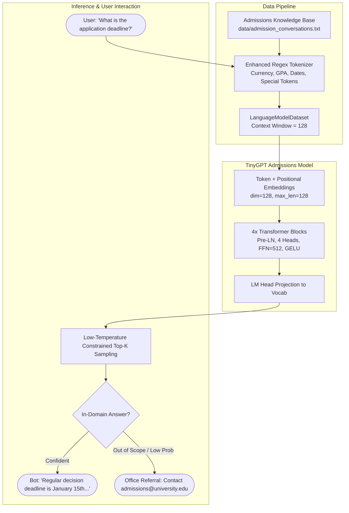

# Implementation Plan: College Admission Bot with TinyGPT

## 1. Executive Summary

This plan outlines the end-to-end roadmap for transforming the current **TinyGPT** project from a toy general-AI demo into a specialized, reliable **College Admission Assistant Bot**.

The goal is to enable prospective students, parents, and applicants to inquire about admission requirements, application deadlines, tuition & financial aid, academic programs, campus life, and application procedures with accurate, domain-coherent responses.

---

## 2. Gap Analysis: Current State vs. Target State

| Feature                    | Current State                                                                                                                 | Required for College Admission Bot                                                                                      |
| -------------------------- | ----------------------------------------------------------------------------------------------------------------------------- | ----------------------------------------------------------------------------------------------------------------------- |
| **Domain Data**            | Generic CS & programming Q&A (~40 pairs) in [data/conversations.txt](file:///c:/projects/NLP/tiny-gpt/data/conversations.txt) | Comprehensive college admissions knowledge base (150–250+ Q&A pairs across 7 key admission categories)                  |
| **Vocabulary & Tokenizer** | Basic word-level regex, lacks symbols for dates, fees (`$`), percentages, GPA formats                                         | Enhanced regex handling currency (`$`), GPA (`3.5`), decimals, dates, and domain terminology                            |
| **Context Length**         | `64` tokens (cuts off multi-sentence answers)                                                                                 | `128` tokens (accommodates detailed requirements and lists)                                                             |
| **Model Capacity**         | ~188K params (2 layers, 64 dim, 4 heads)                                                                                      | Scaled to ~600K–900K params (4 layers, 128 dim, 4 heads) for higher factual retention while retaining fast CPU training |
| **Sampling / Generation**  | High randomness (`temp=0.8`, `top_k=20`)                                                                                      | Factual, deterministic configuration (`temp=0.2–0.4`, `top_k=5`) to prevent hallucination of deadlines/fees             |
| **User Experience**        | Plain terminal prompt                                                                                                         | Persona-aware admissions greeting, sample queries, fallback for unanswerable questions, and contact guidance            |

---

## 3. System Architecture & Information Flow



---

## 4. Phase-by-Phase Implementation Roadmap

### Phase 1: Knowledge Base & Data Engineering

Create a structured domain dataset at `data/admissions_data.txt` covering all facets of university admissions. To ensure robustness to user phrasing, each topic will include multiple question variants.

#### Target Knowledge Domains:

1. **Application Requirements & Eligibility**
   - Minimum GPA requirements (high school & transfer).
   - Standardized test policies (SAT / ACT optional or required).
   - English proficiency (TOEFL / IELTS / Duolingo) for international applicants.
   - Required documents: official transcripts, letters of recommendation, statement of purpose/essay.
2. **Deadlines & Application Rounds**
   - Early Action (EA), Early Decision (ED), and Regular Decision (RD) deadlines.
   - Financial aid / scholarship priority deadlines.
   - Decision notification release dates.
3. **Tuition, Fees & Financial Aid**
   - In-state vs. out-of-state tuition fees.
   - Merit-based scholarships, need-based grants, and work-study programs.
   - FAFSA and CSS Profile submission guidance.
4. **Programs & Majors**
   - Undergrad schools (Engineering, Business, Arts & Sciences, Health Sciences).
   - Undeclared / change of major policies.
5. **Campus Life & Student Services**
   - Freshman housing guarantee and meal plans.
   - Campus tours, open house events, and virtual information sessions.
6. **Transfer & International Inquiries**
   - Transfer credit evaluation policies.
   - Visa / I-20 application assistance.
7. **Official Contacts & Fallbacks**
   - Admissions office email, phone numbers, office hours, and website links.
   - Graceful fallback responses for queries outside admissions scope.

> [!TIP]
> **Data Quality Principle**: Each Q&A pair will follow standard formatting:
>
> ```
> <USER> when is the application deadline for regular decision?
> <ASSISTANT> the regular decision application deadline is january 15th, and decisions are released by late march.
> ```

---

### Phase 2: Tokenizer & Data Preprocessing Upgrades

Modify [src/tokenizer.py](file:///c:/projects/NLP/tiny-gpt/src/tokenizer.py) to handle admissions-specific syntax:

1. **Currency and Numerical Values**: Support symbols like `$`, `%`, and decimals (`3.5`, `3.8`) without splitting them into noisy tokens.
2. **Email & Web Handles**: Ensure contact references like `admissions@university.edu` or URLs are cleanly tokenized or mapped.
3. **Punctuation & Contractions**: Support standard conversational contractions (`can't`, `what's`, `don't`).

---

### Phase 3: Model Scaling & Hyperparameter Tuning

Scale the network parameters in [src/model.py](file:///c:/projects/NLP/tiny-gpt/src/model.py) and [main.py](file:///c:/projects/NLP/tiny-gpt/main.py):

| Parameter        | Original Value | Proposed Value | Rationale                                                                |
| ---------------- | -------------- | -------------- | ------------------------------------------------------------------------ |
| `context_length` | 64             | **128**        | Allows multi-sentence, comprehensive answers without truncation.         |
| `embedding_dim`  | 64             | **128**        | Captures richer semantic relationships between admissions terms.         |
| `num_heads`      | 4              | **4**          | $128 / 4 = 32$ head dimension.                                           |
| `num_layers`     | 2              | **4**          | Adds deeper hierarchical understanding of complex admission policies.    |
| `ff_hidden_dim`  | 256            | **512**        | Standard $4 \times d_{\text{model}}$ ratio.                              |
| `batch_size`     | 16             | **16 or 32**   | Balances gradient stability.                                             |
| `epochs`         | 300            | **200–350**    | Early stop when cross-entropy loss $< 0.15$ for tight factual retention. |

> [!NOTE]
> Even with 4 layers and 128 embedding dimensions (~800K parameters), CPU training time will remain under **2 to 3 minutes** on standard modern machines.

---

### Phase 4: Inference & Generation Calibration

Adapt [src/generation.py](file:///c:/projects/NLP/tiny-gpt/src/generation.py) specifically for factual Q&A:

- **Temperature reduction**: Lower temperature from `0.8` to `0.25 – 0.35` so the model selects the highest-probability factual tokens.
- **Top-k tuning**: Restrict `top_k` to `5` to prevent non-admissions vocabulary from drifting into responses.
- **Repetition penalty**: Optional simple frequency/presence penalty to prevent loops in list-style answers.

---

### Phase 5: Admissions Bot Chat Experience & CLI

Create a dedicated runner script `admissions_chat.py`:

- Welcome banner introducing the College Admissions Office Assistant.
- Display sample queries (e.g., _"What is the tuition fee?"_, _"What are the deadlines?"_, _"Is SAT required?"_).
- Command shortcuts:
  - `faq`: Prints top 5 most common admissions questions.
  - `contact`: Instantly prints admissions office email, phone, and office hours.
  - `debug <query>`: Inspect token logits and attention distributions.
  - `quit`: Exit chat.

---

### Phase 6: Automated Testing & Evaluation Suite

Develop `evaluate_admissions.py` to benchmark model accuracy:

1. **Benchmark Test Set**: 25 varied test prompts spanning all 7 admission categories.
2. **Keyword & Factual Verification**: Check if correct dates, fees, and requirements are included in the generated answers.
3. **Perplexity / Validation Loss Tracking**: Ensure the model achieves $< 0.20$ loss without loss divergence.

---

## 5. File Impact Summary

```
tiny-gpt/
├── data/
│   ├── conversations.txt          # (Existing) Legacy CS Q&A
│   └── admissions_data.txt        # [NEW] Curated College Admissions Q&A corpus
├── src/
│   ├── tokenizer.py               # [MODIFIED] Enhanced regex for currency, GPA, dates
│   ├── model.py                   # [VERIFIED] Supports scaled config
│   ├── dataset.py                 # [VERIFIED] Context length 128 support
│   └── generation.py              # [MODIFIED] Admissions-optimized sampling parameters
├── train_admissions.py            # [NEW] Dedicated training pipeline with admissions config
├── admissions_chat.py             # [NEW] Interactive admissions bot terminal UI
└── evaluate_admissions.py         # [NEW] Automated evaluation and factual verification script
```

---

## 6. Execution Milestones

1. **Milestone 1**: Curate `data/admissions_data.txt` with ~150+ high-quality Q&A pairs.
2. **Milestone 2**: Update tokenizer to cleanly process numbers, currency, and punctuation.
3. **Milestone 3**: Implement `train_admissions.py` and train the checkpoint to `checkpoints/tinygpt_admissions.pt`.
4. **Milestone 4**: Validate with `evaluate_admissions.py` across test questions.
5. **Milestone 5**: Launch interactive `admissions_chat.py` and verify multi-turn interaction.
